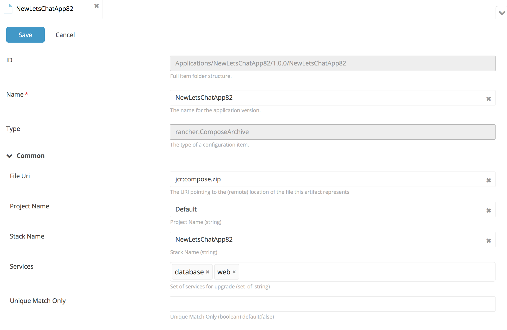

# XL Deploy Rancher plugin

[![Build Status][xld-rancher-plugin-travis-image]][xld-rancher-plugin-travis-url]
[![License: MIT][xld-rancher-plugin-license-image]][xld-rancher-plugin-license-url]
![Github All Releases][xld-rancher-plugin-downloads-image]

[xld-rancher-plugin-travis-image]: https://travis-ci.org/xebialabs-community/xld-rancher-plugin.svg?branch=master
[xld-rancher-plugin-travis-url]: https://travis-ci.org/xebialabs-community/xld-rancher-plugin
[xld-rancher-plugin-license-image]: https://img.shields.io/badge/License-MIT-yellow.svg
[xld-rancher-plugin-license-url]: https://opensource.org/licenses/MIT
[xld-rancher-plugin-downloads-image]: https://img.shields.io/github/downloads/xebialabs-community/xld-rancher-plugin/total.svg

## Preface

This document describes the functionality provided by the XL Deploy|Release Description|Interface plugin.

See the [XL Deploy reference manual](https://docs.xebialabs.com/xl-deploy) for background information on XL Deploy and deployment automation concepts.  

## Overview

This XL Deploy plugin creates and upgrades Rancher stacks.

## Requirements

* XL Deploy 6.0+

## Installation

* Copy the latest JAR file from the [releases page](https://github.com/xebialabs-community/xld-rancher-plugin/releases) into the `XL_DEPLOY_SERVER/plugins` directory.
* Restart the XL Deploy server.

## Usage

### Configure the CLI interface ###

Set up a rancher.RancherCliClient object with Rancher server URL, access key and secret key.

### Configure the REST interface ###

Define a rancher.RancherRestClient object in the Infrastructure tree.  It can be located under the root node or any folder.  Set the host (DNS or IP), port, access key, and secret key.

### Configure the Rancher Compose Archive

To configure a rancher.ComposeArchive object for deployment:

* Create a docker-compose.yml file and a rancher-compose.yml file.  

* Zip them into a single archive to be used as the artifact.

* Specify the project and stack names.

* Enter the names of the services that should be upgraded under a NOOP deployment.

* Set the uniqueMatchOnly flag to true if the deployment should abort on multiple matches for the project and stack names.

### Deploying ###

Deploy the rancher.ComposeArtifact to the rancher.RancherCliClient or to the rancher.RancherRestClient in order to create, update, upgrade, or delete the corresponding object on Rancher.

### Mapping of XL Deploy actions to Rancher actions #####

**CLI**

* CREATE -- implemented to create a stack

* MODIFY

* NOOP

* DESTROY

**REST**

* CREATE -- implemented to create a stack

* MODIFY

* NOOP  -- implemented to upgrade the listed services

* DESTROY

